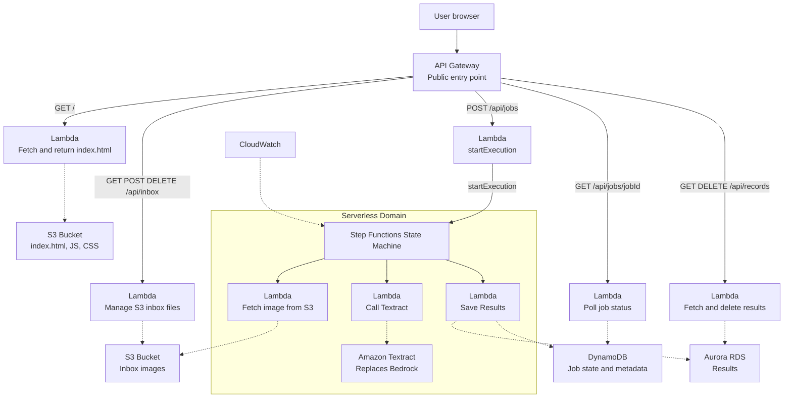

# CMSC 471 – Final Project  
### Migrating a Legacy 3‑Tier Image Processing System to a 4‑Tier AWS Serverless Architecture

This repository contains the code, IaC templates, DevOps artifacts, and documentation for the CMSC471 final project. The goal is to modernize a legacy 3‑tier image processing system into a scalable, cloud‑native, serverless 4‑tier architecture using AWS services.

---

## Architecture Overview

The system follows the required 4‑tier model:

1. **Presentation (Tier 1)**  
   Static frontend served from S3 (or API Gateway fallback), providing UI for inbox, processing, and records.

2. **API / Compute (Tier 2)**  
   API Gateway routes requests to Lambda functions for inbox management, job submission, polling, and record retrieval.

3. **Orchestration (Tier 3)**  
   AWS Step Functions coordinate Lambdas that:
   - Fetch images from S3  
   - Call Amazon Textract  
   - Save results to DynamoDB and Aurora  

4. **Persistence (Tier 4)**  
   - S3 for raw images  
   - DynamoDB for job state  
   - Aurora (conceptual) for relational metadata  

---

## Architecture Diagram



---


## DevOps & BDD

- Azure Boards used for Epic → Features → User Stories → Tasks  
- Commit messages use `AB#ID` syntax for traceability  
- Tests stored under `tests/`  
- Evidence screenshots included in `docs/`

---

 ## Deployment

### Deploy
```bash
sam build
sam deploy --guided
```

### Sync for rapid iteration
```bash
sam sync --watch
```


### Teardown
```bash
sam delete
```


---

## Documentation

All required screenshots, diagrams, and written analysis are located in:

**docs/** 
   
This includes:
   - Architecture diagram  
   - DevOps mapping  
   - IaC evidence  
   - Step Functions workflow  
   - Security/IAM notes  
   - Well‑Architected review  
   - TCO calculator report  

---

## Status

This project implements the core components of the required 4‑tier architecture and provides documentation aligned with the CMSC471 final project rubric.

