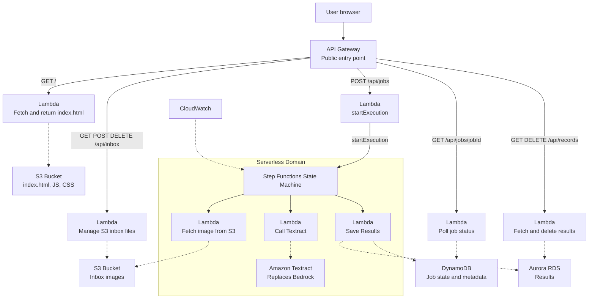

# CMSC471
Version Control and Repo for Final Project

# Migrate legacy 3-tier image processing to 4-Tier AWS Bedrock serverless architecture

## Overview
This project modernizes a legacy 3-tier image processing system into a scalable 4-tier cloud-native serverless architecture using AWS services and Amazon Bedrock for AI-powered image processing, orchestration, and distributed data management.

## Architecture Diagram

