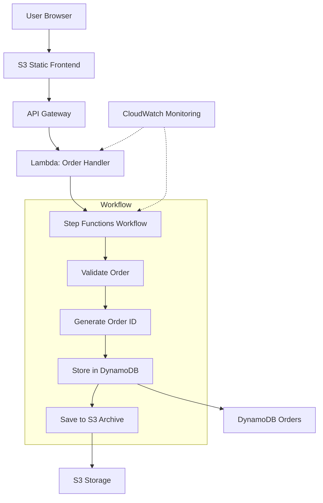

# CMSC471
Version Control and Repo for Final Project

# Order Confirmation System (AWS 4-Tier Architecture)

## Overview
This project implements a serverless order confirmation system using AWS services including API Gateway, Lambda, Step Functions, DynamoDB, and S3.

## Architecture Diagram

